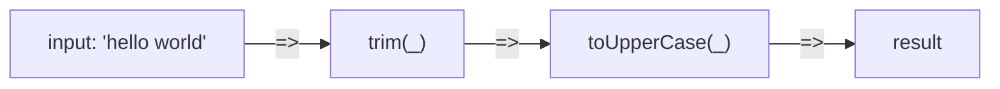
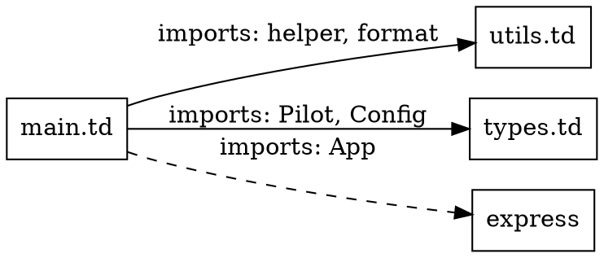

# グラフモデル リファレンス

## 共通定義

### GraphNode

全グラフビューに共通するノード型。

```taida
GraphNode = @(
  id: Str
  kind: Str
  label: Str
  location: @(
    file: Str
    line: Int
    column: Int
  )
  metadata: @()
)
```

| フィールド | 型 | 説明 |
|-----------|-----|------|
| `id` | `Str` | ノードの一意識別子（`file:line:col:kind` 形式） |
| `kind` | `Str` | ノード種別（ビューごとに定義） |
| `label` | `Str` | 表示用ラベル |
| `location` | `@(file, line, column)` | ソースコード上の位置 |
| `metadata` | `@()` | ビュー固有の追加情報 |

### GraphEdge

全グラフビューに共通するエッジ型。

```taida
GraphEdge = @(
  source: Str
  target: Str
  kind: Str
  label: Str
  metadata: @()
)
```

| フィールド | 型 | 説明 |
|-----------|-----|------|
| `source` | `Str` | 始点ノードのID |
| `target` | `Str` | 終点ノードのID |
| `kind` | `Str` | エッジ種別（ビューごとに定義） |
| `label` | `Str` | 表示用ラベル |
| `metadata` | `@()` | ビュー固有の追加情報 |

### Graph

グラフ全体を表現する型。

```taida
Graph = @(
  view: Str
  nodes: @[GraphNode]
  edges: @[GraphEdge]
  metadata: @(
    source_files: @[Str]
    generated_at: Str
    taida_version: Str
  )
)
```

---

## データフローグラフ

### ノード種別

| `kind` | 説明 | 抽出元 |
|--------|------|--------|
| `Variable` | 変数 | `x <= ...` / `... => x` |
| `FunctionCall` | 関数呼び出し | `func(...)` |
| `Literal` | リテラル値 | `42`, `"hello"`, `@[...]` |
| `BuchiPack` | ぶちパック | `@(...)` |
| `Unmold` | アンモールディング操作 | `]=>` / `<=[` / `.unmold()` |
| `Placeholder` | プレースホルダ | `_` |
| `Condition` | 条件分岐 | `\| cond \|>` |

### エッジ種別

| `kind` | 説明 | 抽出元演算子 |
|--------|------|------------|
| `PipeForward` | 順方向パイプ | `=>` |
| `PipeBackward` | 逆方向パイプ | `<=` |
| `UnmoldForward` | 順方向アンモールド | `]=>` |
| `UnmoldBackward` | 逆方向アンモールド | `<=[` |
| `Argument` | 関数引数 | `func(arg)` |
| `Return` | 戻り値 | `=> :Type` |
| `ConditionTrue` | 条件真 | `\| cond \|> value` |
| `ConditionFalse` | 条件偽 / デフォルト | `\| _ \|> value` |

### 抽出規則

| 構文パターン | 生成されるノード | 生成されるエッジ |
|-------------|----------------|----------------|
| `a => b` | `a`: Variable, `b`: Variable | `a -> b`: PipeForward |
| `a => func(_) => b` | `a`: Variable, `func(_)`: FunctionCall, `b`: Variable | `a -> func(_)`: PipeForward, `func(_) -> b`: PipeForward |
| `b <= a` | `a`: Variable, `b`: Variable | `a -> b`: PipeBackward |
| `mold ]=> x` | `mold`: Variable, `x`: Variable | `mold -> x`: UnmoldForward |
| `x <=[ mold` | `mold`: Variable, `x`: Variable | `mold -> x`: UnmoldBackward |
| `func(a, b)` | `func(a, b)`: FunctionCall, `a`: *, `b`: * | `a -> func`: Argument, `b -> func`: Argument |

> **注意**: 単一方向制約により、一つの文内で `PipeForward` と `PipeBackward` が同時に出現することはありません。同様に `UnmoldForward` と `UnmoldBackward` も同時に出現しません。

---

## モジュール依存グラフ

### ノード種別

| `kind` | 説明 | 抽出元 |
|--------|------|--------|
| `Module` | ローカルモジュール | `.td` ファイル |
| `ExternalPackage` | 外部パッケージ | `>>> package => ...` |
| `Symbol` | インポート/エクスポートされたシンボル | `@(sym1, sym2)` |

### エッジ種別

| `kind` | 説明 | 抽出元演算子 |
|--------|------|------------|
| `Imports` | モジュールのインポート | `>>>` |
| `Exports` | シンボルのエクスポート | `<<<` |
| `SymbolRef` | シンボルの使用 | インポートしたシンボルの参照 |

### 抽出規則

| 構文パターン | 生成されるノード | 生成されるエッジ |
|-------------|----------------|----------------|
| `>>> ./file.td => @(a, b)` | 現ファイル: Module, `./file.td`: Module, `a`, `b`: Symbol | 現ファイル -> `./file.td`: Imports |
| `>>> pkg@1.0 => @(func)` | 現ファイル: Module, `pkg`: ExternalPackage, `func`: Symbol | 現ファイル -> `pkg`: Imports |
| `<<< @(a, b)` | `a`, `b`: Symbol | 現ファイル -> `a`: Exports, 現ファイル -> `b`: Exports |

---

## 型階層グラフ

### ノード種別

| `kind` | 説明 | 抽出元 |
|--------|------|--------|
| `PrimitiveType` | プリミティブ型 | `Int`, `Str`, `Bool`, `Float` |
| `BuchiPackType` | ぶちパック型 | `TypeName = @(...)` |
| `MoldType` | モールディング型 | `Mold[T] => TypeName[T] = @(...)` |
| `ErrorType` | エラー型 | `Error => ErrorName = @(...)` |

### エッジ種別

| `kind` | 説明 | 抽出元 |
|--------|------|--------|
| `MoldInheritance` | Mold基底クラスからの継承 | `Mold[T] => ...` |
| `ErrorInheritance` | Error基底型からの継承 | `Error => ...` |
| `StructuralSubtype` | 構造的サブタイプ | `ParentType => ChildType = @(...)` |

### 抽出規則

| 構文パターン | 生成されるノード | 生成されるエッジ |
|-------------|----------------|----------------|
| `Name = @(...)` | `Name`: BuchiPackType | なし |
| `Mold[T] => Name[T] = @(...)` | `Name`: MoldType | `Mold[T] -> Name`: MoldInheritance |
| `Error => Name = @(...)` | `Name`: ErrorType | `Error -> Name`: ErrorInheritance |
| `Parent => Child = @(...)` | `Child`: BuchiPackType | `Parent -> Child`: StructuralSubtype |

---

## エラー境界グラフ

### ノード種別

| `kind` | 説明 | 抽出元 |
|--------|------|--------|
| `ErrorCeiling` | エラー天井 | `\|== error: Type = ...` |
| `ThrowSite` | throwの発生位置 | `ErrorType(...).throw()` |
| `Function` | エラー天井を含む関数 | 関数定義 |
| `GorillaCeiling` | ゴリラ天井（暗黙） | トップレベル（明示的なエラー天井がない場合） |

### エッジ種別

| `kind` | 説明 | 抽出元 |
|--------|------|--------|
| `Catches` | エラー天井がthrowをキャッチ | `\|==` と `.throw()` の関係 |
| `ThrowsTo` | throwからエラー天井への伝播 | `.throw()` の伝播先 |
| `Propagates` | エラーの関数間伝播 | 内部関数のthrowが外部関数のエラー天井に到達 |

### 抽出規則

| 構文パターン | 生成されるノード | 生成されるエッジ |
|-------------|----------------|----------------|
| `\|== error: T = ...` | ErrorCeiling(T) | なし |
| `ErrorType(...).throw()` | ThrowSite(ErrorType) | ThrowSite -> 最近のErrorCeiling: ThrowsTo |
| 関数内のエラー天井 | Function | Function内のErrorCeiling: Contains |
| エラー天井なしのthrow | ThrowSite | ThrowSite -> 呼び出し元のErrorCeiling: Propagates |

---

## コールグラフ

### ノード種別

| `kind` | 説明 | 抽出元 |
|--------|------|--------|
| `Function` | 名前付き関数 | `funcName args = ...` |
| `AnonymousFn` | 無名関数 | `_ x = x * 2` |
| `Method` | メソッド | ぶちパック/モールディング型内の関数 |
| `Entrypoint` | エントリーポイント | `taida` コマンドで実行されるファイル |

### エッジ種別

| `kind` | 説明 | 抽出元 |
|--------|------|--------|
| `Calls` | 関数呼び出し | `func(args)` |
| `TailCalls` | 末尾呼び出し | 末尾位置での `func(args)` |
| `CallsLambda` | 無名関数の呼び出し | `Map[..., _ x = ...]()` |

### 抽出規則

| 構文パターン | 生成されるエッジ |
|-------------|----------------|
| 関数A内の `funcB(args)` | `A -> funcB`: Calls |
| 関数A内の末尾位置の `funcB(args)` | `A -> funcB`: TailCalls |
| 関数A内の `Map[data, _ x = ...]()` | `A -> _lambda_N`: CallsLambda |

---

## クエリ言語

### クエリ構文

```
query_expr := query_name "(" args ")"
args       := arg ("," arg)*
arg        := node_id | "*" | query_expr
node_id    := IDENTIFIER
```

### クエリ一覧

| クエリ | 入力 | 出力 | 説明 |
|--------|------|------|------|
| `path_exists(a, b)` | ノードID × 2 | `Bool` | `a` から `b` へのパスが存在するか |
| `shortest_path(a, b)` | ノードID × 2 | `@[GraphNode]` | `a` から `b` への最短パス |
| `reachable(a)` | ノードID | `@[GraphNode]` | `a` から到達可能な全ノード |
| `find_cycles()` | なし | `@[@[GraphNode]]` | グラフ内の全循環 |
| `uncovered_throws()` | なし | `@[GraphNode]` | エラー天井でカバーされていないthrowサイト |
| `unreachable_functions()` | なし | `@[GraphNode]` | エントリーポイントから到達不能な関数 |
| `dependents(a)` | ノードID | `@[GraphNode]` | `a` に依存する全ノード |
| `dependencies(a)` | ノードID | `@[GraphNode]` | `a` が依存する全ノード |
| `fan_in(a)` | ノードID | `Int` | `a` に入るエッジ数 |
| `fan_out(a)` | ノードID | `Int` | `a` から出るエッジ数 |

### クエリの使用例

```bash
# データフローグラフに対するクエリ
taida graph query --type dataflow --query "path_exists(input, result)" ./src/main.td

# モジュール依存グラフの循環検出
taida graph query --type module --query "find_cycles()" ./src

# エラーカバレッジの検証
taida graph query --type error --query "uncovered_throws()" ./src

# 特定関数の呼び出し元を列挙
taida graph query --type call --query "dependents(processData)" ./src
```

---

## 出力形式

### JSON

```bash
taida graph --type dataflow --format json ./src/main.td
```

```json
{
  "view": "dataflow",
  "nodes": [
    {
      "id": "main.td:1:1:Variable",
      "kind": "Variable",
      "label": "input",
      "location": { "file": "main.td", "line": 1, "column": 1 },
      "metadata": {}
    },
    {
      "id": "main.td:2:10:FunctionCall",
      "kind": "FunctionCall",
      "label": "trim(_)",
      "location": { "file": "main.td", "line": 2, "column": 10 },
      "metadata": {}
    }
  ],
  "edges": [
    {
      "source": "main.td:1:1:Variable",
      "target": "main.td:2:10:FunctionCall",
      "kind": "PipeForward",
      "label": "=>",
      "metadata": {}
    }
  ],
  "metadata": {
    "source_files": ["main.td"],
    "generated_at": "2026-02-26T10:00:00Z",
    "taida_version": "0.1.0"
  }
}
```

### Mermaid

```bash
taida graph --type dataflow --format mermaid ./src/main.td
```



### Graphviz (DOT)

```bash
taida graph --type module --format dot ./src
```



---

## 構造サマリスキーマ

### StructuralSummary

```taida
StructuralSummary = @(
  version: Str
  project: Str
  timestamp: Str
  stats: ProjectStats
  dataflow: DataflowStats
  modules: ModuleStats
  errors: ErrorStats
  type_hierarchy: TypeHierarchyStats
)

ProjectStats = @(
  files: Int
  functions: Int
  types: Int
  mold_types: Int
  error_types: Int
  modules: Int
)

DataflowStats = @(
  total_pipes: Int
  forward_pipes: Int
  backward_pipes: Int
  unmold_operations: Int
)

ModuleStats = @(
  total_imports: Int
  total_exports: Int
  external_packages: Int
  has_cycles: Bool
  cycle_details: @[@[Str]]
)

ErrorStats = @(
  total_ceilings: Int
  total_throw_sites: Int
  uncovered_throws: Int
  error_types_used: @[Str]
  gorilla_ceiling_count: Int
)

TypeHierarchyStats = @(
  max_depth: Int
  mold_types: @[Str]
  error_types: @[Str]
  structural_subtypes: @[@(parent: Str, child: Str)]
)
```

### FileStructure

個別ファイルの構造情報。

```taida
FileStructure = @(
  file: Str
  functions: @[FunctionInfo]
  types: @[TypeInfo]
  imports: @[ImportInfo]
  exports: @[ExportInfo]
  error_ceilings: @[ErrorCeilingInfo]
)

FunctionInfo = @(
  name: Str
  line: Int
  params: @[@(name: Str, type: Str)]
  return_type: Str
  calls: @[Str]
  is_exported: Bool
)

TypeInfo = @(
  name: Str
  line: Int
  kind: Str
  parent: Str
  fields: @[@(name: Str, type: Str)]
)

ImportInfo = @(
  source: Str
  symbols: @[Str]
  line: Int
)

ExportInfo = @(
  symbols: @[Str]
  line: Int
)

ErrorCeilingInfo = @(
  error_type: Str
  line: Int
  handles: @[Str]
)
```

---

## CLIリファレンス

CLI 全体の仕様は [CLI リファレンス](./cli.md) を参照してください。  
このページでは `graph` / `verify` に関係する最小情報のみ記載します。

### `taida graph`

```
taida graph [--type TYPE] [--format FORMAT] <PATH>
taida graph summary [--type TYPE] [--format FORMAT] <PATH>
taida graph query --type TYPE --query EXPR <PATH>
```

| オプション | 短縮 | 説明 |
|---|---|---|
| `--type <TYPE>` | `-t` | `dataflow` / `module` / `type-hierarchy` / `error` / `call` |
| `--format <FORMAT>` | `-f` | `text` / `json` / `mermaid` / `dot` |
| `--query <EXPR>` | - | `query` サブコマンド用 |

注:
- 現状 `<PATH>` は単一ファイル入力です。
- `summary` は構造サマリを出力します。

### `taida verify`

```
taida verify [--check CHECK] [--format FORMAT] <PATH>
```

| オプション | 短縮 | 説明 |
|---|---|---|
| `--check <CHECK>` | `-c` | 実行チェック（複数指定可） |
| `--format <FORMAT>` | `-f` | `text` / `json` / `sarif` |

### 検証チェック一覧

| チェック名 | 重要度 | 説明 |
|---|---|---|
| `error-coverage` | error | throw サイトのカバレッジ検証 |
| `no-circular-deps` | error | モジュール循環依存検出 |
| `dead-code` | warning | 到達不能関数検出 |
| `type-consistency` | error | 型階層の循環検出 |
| `unchecked-division` | warning | 除算安全性チェック枠（現行構文では通常 finding なし） |
| `direction-constraint` | error | 単一方向制約の検証 |
| `unchecked-lax` | warning | Lax 未検査利用検出 |
| `naming-convention` | warning | 命名規約違反検出 |
